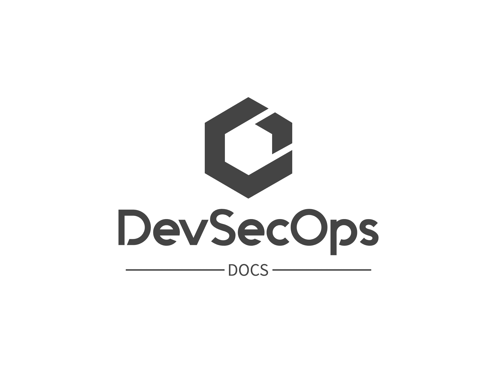

<h1 align="center">
  <br>
    
  <br>
  <br>
</h1>

This site is meant to host documentation, as well as blogs, for DevSecOps related topics. This includes things such as securing the software development lifecycle, cloud security, infrastructure as code, and modern cloud native applications. Contributions are welcome!

## Blogs

Contains technical guides that include instructional guidance on solving a given problem. This can also include other off topic items outside of the documentation.

## Local Development

To get started developing on the site, you need to make sure you have `npm` installed and install the dependancies. To update the times on a given page you can perform `date +"%Y-%m-%dT%H:%M:%S%z" | pbcopy`

### Install Dependancies

Install the dependancies are required prior to developing. 

```bash
npm install
```

### Development Server

To view and build the site locally, run the following commands.

```bash
npm run dev
```

## Build

This repository uses github actions to build and deploy the hugo site to S3. Once uploaded, cloudfront serves the pages to the users.

## Credit

- [Hugo](https://gohugo.io/documentation/)
- [Doks](https://getdoks.org/)
