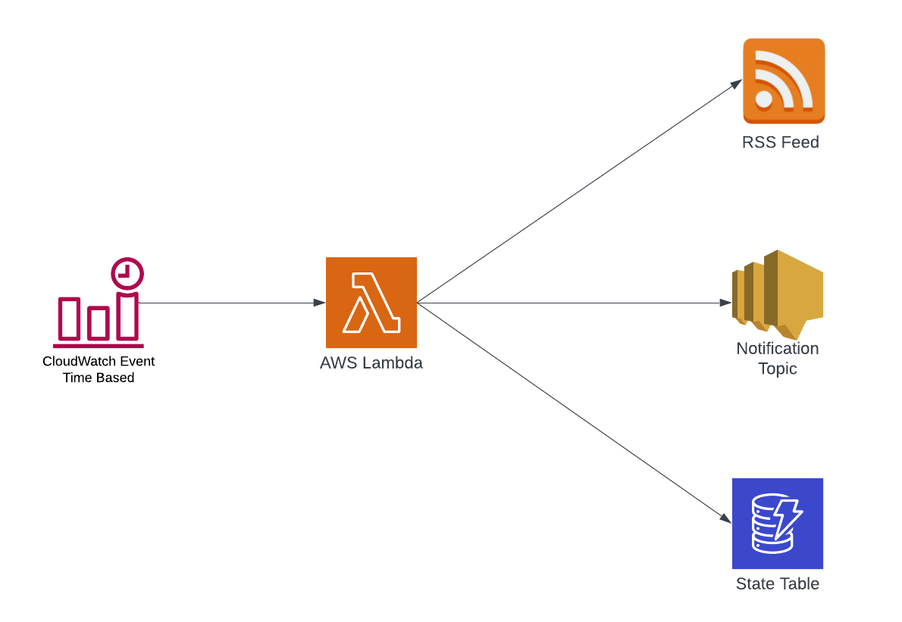

Have you ever want to be notified of new security advisories? Not sure how to do so? In this blog post we will go over how you can notify your team of new RSS security advisory feeds through lambda, sns, cloudwatch events, and dynamodb to ensure you get the latest notifications. This goes over the creation of [RSS Notification Terraform Module](https://github.com/DevSecOpsDocs/terraform-rss-notifications) and how to setup alerts for your given advisory feed. 



## Advisory Feeds

Often times security advisories are sent to RSS feeds but they do not provide you an excellent way of getting your team notified when a new advisory comes out. It's not uncommon for individuals to have RSS readers to keep up to date with these it is currently the best centralized way of reviewing new advisories. 

- [Amazon Web Services Security Bulletin](https://aws.amazon.com/security/security-bulletins/rss/feed/) 
- [Jenkins Security Advisory](https://www.jenkins.io/security/advisories/rss.xml)
- [Grafana Security Advisory](https://grafana.com/tags/security/index.xml)
- [ElasticSearch Security Advisory](https://discuss.elastic.co/c/announcements/security-announcements.rss)
- [National Vulnerability Database NVD](https://nvd.nist.gov/download/nvd-rss.xml)
- [US-CERT](https://www.us-cert.gov/ncas/alerts.xml)

## News Feeds

Sometimes you want to keep up to date with the latest news, here are some examples of RSS news notifications.

- [Krebs on Security](https://krebsonsecurity.com/feed/)
- [Threatpost](https://threatpost.com/feed/)
- [SecurityWeek](https://www.securityweek.com/rss/feed)
- [The Hacker News](https://thehackernews.com/feeds/posts/default)
- [DarkReading](https://www.darkreading.com/rss_simple.asp)

### Jenkins Plugins

Let's say you want to get notified when a Jenkins Plugin receives a new security advisory, you deploy the following leveraging [terragrunt](https://terragrunt.gruntwork.io/docs/getting-started/quick-start/). 

```
terraform {
  source = "git::git@github.com:DevSecOpsDocs/terraform-rss-notifications.git"
}

inputs = {
  alert_name = "jenkins-plugin"
  hours_since = 72
  rss_feed_url = "https://www.jenkins.io/security/advisories/rss.xml"
  rss_filter = "Affects plugin: <a href='https://plugins.jenkins.io/git'>Git</a>"

  tags = {
    "Name"  = "jenkins-plugin"
    "Owner" = "security"
  }
}
```

#### Variables

The `alert_name` is just the name for the resources that terraform will create, `hours_since` determines how far back to check when iterating through advisories, `rss_feed_url` is the url of the rss feed, and `rss_filter` is a string you can use to filter on the rss feed. In order for you to get notified of multiple plugins, all you need to do is add a comma delimeter and it will check for multiple plugins. 

#### DynamoDB

In order to determine if an item has already been alerted on, we need to store the state in the dynamodb table. In which we use the url as the primary key, hash key, to do so. This also stores additional information about what the event will look like. 


```json
{
    "Item": {
        "published": {
            "S": "2022-08-23T12:00:00Z"
        },
        "ttl": {
            "N": "1671475410"
        },
        "description": {
            "S": "<ul>\n<li>Affects plugin: <a href='https://plugins.jenkins.io/collabnet'>CollabNet Plugins</a></li>\n<li>Affects plugin: <a href='https://plugins.jenkins.io/git'>Git</a></li>\n<li>Affects plugin: <a href='https://plugins.jenkins.io/jobConfigHistory'>Job Configuration History</a></li>\n<li>Affects plugin: Kubernetes Continuous Deploy\n</ul>"
        },
        "url": {
            "S": "https://www.jenkins.io/security/advisory/2022-08-23/"
        },
        "alerted_at": {
            "S": "2022-12-19T18:43:30Z"
        },
        "title": {
            "S": "Jenkins Security Advisory 2022-08-23"
        }
    }
}
```

#### Execution

Here is what the Lambda function will execute with when there is currently no notification stored in state. 

```
START RequestId: b751bd80-9c86-417d-beb5-634d43d1cb4a Version: $LATEST
2022/12/19 19:46:01 Alert not in the table, adding "https://www.jenkins.io/security/advisory/2022-08-23/" as the primary key for the alert "Jenkins Security Advisory 2022-08-23"
2022/12/19 19:46:01 Alert "Jenkins Security Advisory 2022-08-23" has not been alerted on, sending to SNS
2022/12/19 19:46:01 Send notification to SNS at b0e35dcb-fc7a-535c-b36f-01d13dc3d3b7 with the title: Jenkins Security Advisory 2022-08-23
END RequestId: b751bd80-9c86-417d-beb5-634d43d1cb4a
REPORT RequestId: b751bd80-9c86-417d-beb5-634d43d1cb4a	Duration: 889.00 ms	Billed Duration: 890 ms	Memory Size: 128 MB	Max Memory Used: 48 MB	Init Duration: 134.95 ms	
```

When the notification has already been alerted on. 

```
START RequestId: 6f824f70-49e2-44f1-bbb3-f77d94734f86 Version: $LATEST
2022/12/19 18:44:20 Jenkins Security Advisory 2022-08-23 has already alerted on.
END RequestId: 6f824f70-49e2-44f1-bbb3-f77d94734f86
REPORT RequestId: 6f824f70-49e2-44f1-bbb3-f77d94734f86	Duration: 67.33 ms	Billed Duration: 68 ms	Memory Size: 128 MB	Max Memory Used: 32 MB	
```
